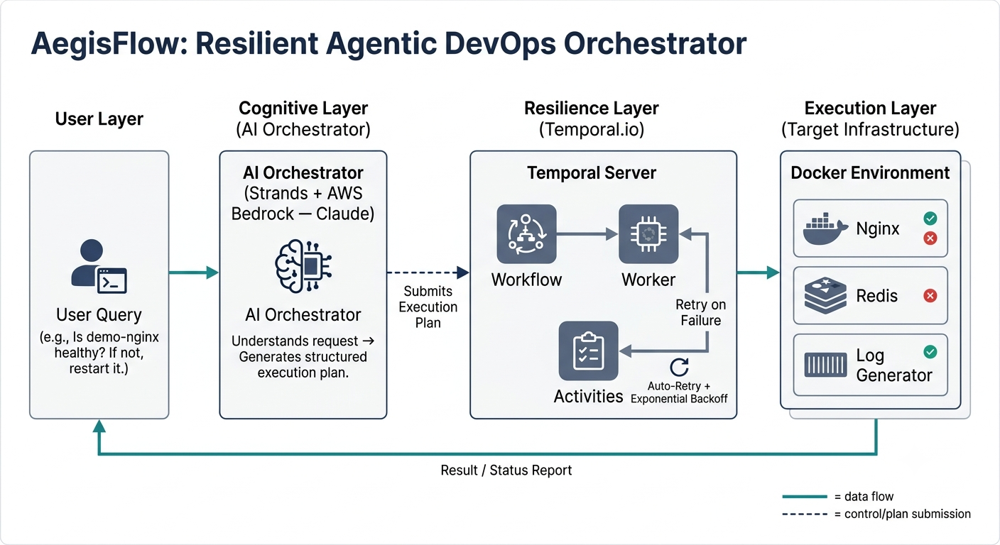
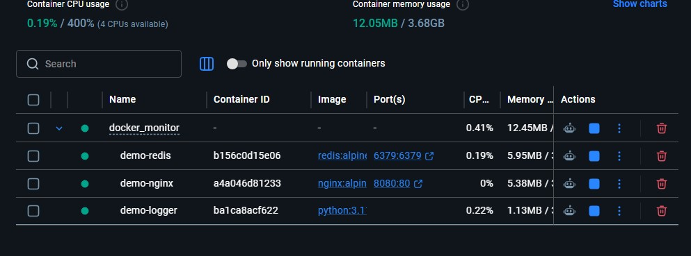
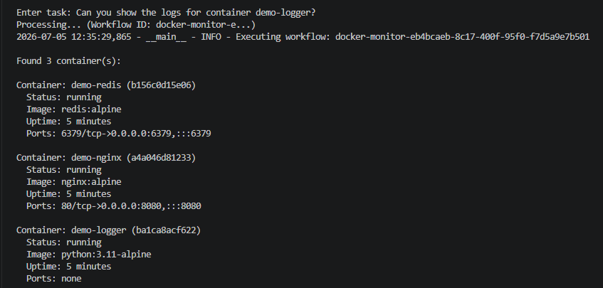
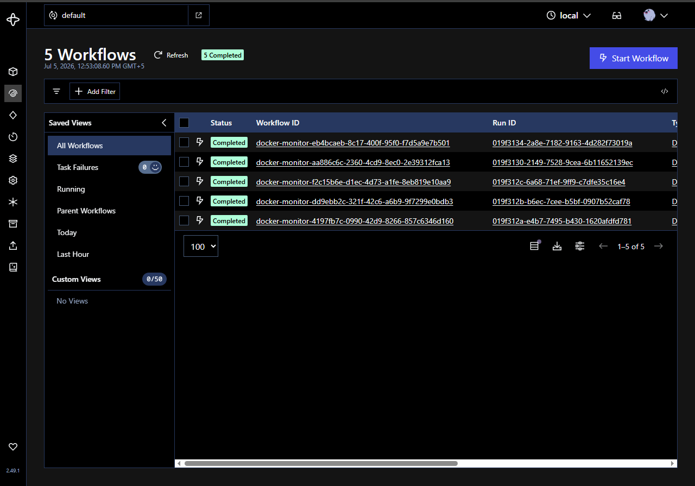
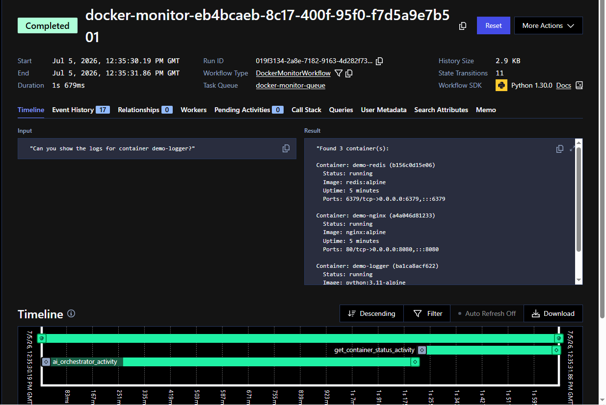

# 🛡️ AegisFlow: Resilient Agentic DevOps Orchestrator

**AegisFlow** is a visionary orchestration engine that combines the **cognitive reasoning of AI agents** with the **bulletproof reliability of durable workflow execution**. It demonstrates how to transition AI-driven automations from simple, fragile scripts into production-ready, self-healing DevOps systems.

---

## 🌟 The Vision: Intelligent Brain meets Durable Muscle

When building AI agents to perform tasks (like fetching weather or managing server containers), developers usually write direct execution scripts. While easy to build, these simple agents are fragile—if the network drops, the API rate limit is hit, or the server crashes, the task fails completely.

**AegisFlow** solves this by marrying two core technologies:
1. **Strands Framework + AWS Bedrock (Claude)**: The *Cognitive Layer (Brain)* that understands natural language queries, makes decisions, and creates step-by-step action plans.
2. **Temporal.io**: The *Resilience Layer (Muscle)* that guarantees every step of that plan is executed reliably. If a step fails, Temporal automatically retries it, keeps a perfect history, and recovers gracefully from crashes.

---

## 🗂️ Project Architecture: Simple vs. Durable Agents

AegisFlow contains two key demonstrations:

### 1. 🌤️ The Simple Agent (`simple_agent/`)
A basic playground demonstrating time, weather, and file operations.
* **Simple Mode** ([agent.py](file:///C:/Users/CORE%20I-5/Desktop/AI-for-devops/strands-temporal-agents/simple_agent/agent.py)): A CLI tool that asks Claude to call local Python functions to fetch the weather or list files.
* **Durable Mode** ([temporal_agent.py](file:///C:/Users/CORE%20I-5/Desktop/AI-for-devops/strands-temporal-agents/simple_agent/temporal_agent.py)): Run via Temporal, where each task is isolated into a resilient "Activity" and tracked by a "Workflow".

### 2. 🐳 The Docker Container Health Monitor (`docker_monitor/`)
A real-world DevOps application that monitors and repairs Docker containers using natural language.
* **Capabilities**: Check container status, verify CPU/RAM usage, analyze container logs to detect error patterns, and restart crashed or unhealthy containers.
* **Simple Mode** ([docker_agent.py](file:///C:/Users/CORE%20I-5/Desktop/AI-for-devops/strands-temporal-agents/docker_monitor/docker_agent.py)): Executes commands directly. If a Docker call fails or times out, it aborts.
* **Durable Mode** ([docker_temporal_agent.py](file:///C:/Users/CORE%20I-5/Desktop/AI-for-devops/strands-temporal-agents/docker_monitor/docker_temporal_agent.py)): Submits operations to Temporal. Each Docker action has a custom retry policy (e.g., restarting containers retries up to 5 times with exponential backoff).

---

## 🏗️ How AegisFlow Works Under the Hood

### 📐 System Architecture


### The Execution Models

#### A. Direct Execution (Simple Agent)
```
User Query ──> Agent (LLM) ──> Tool Calls ──> Return Result
```
* **Pros**: Super fast setup, great for prototyping.
* **Cons**: No fault tolerance. If the process is killed midway, the state is lost.

#### B. Durable Orchestration (AegisFlow Workflow)
```
User Query ──> Client ──> Temporal Server ──> Worker ──> Activities (Docker/API) ──> Result
                                ↑
                        AI Orchestrator (Plans actions)
```
1. **Understand & Plan**: The **AI Orchestrator** parses the user's request (e.g., *"Is demo-nginx healthy? If not, restart it."*) and outputs a structured execution plan.
2. **Durable Execution**: The **Temporal Server** schedules the activities in the plan.
3. **Execution & Recovery**: The **Worker** executes each activity. If a container restart fails, Temporal automatically retries it behind the scenes without restarting the entire workflow.

---

## 📸 Visual Showcase (System in Action)

Here is a visual walk-through of AegisFlow monitoring and repairing containers:

### 1. Monitored Infrastructure (Docker Desktop)
The system monitors a stack of demo containers (Nginx, Redis, and a log generator) running locally.

*Figure 1: Monitored demo containers running in Docker Desktop showing resource statistics.*

### 2. The Interactive Command Interface
Users can command the orchestrator in plain English to check, analyze, or restart containers.

*Figure 2: Interactive CLI client running a container log analysis and status checks.*

### 3. The Orchestration Control Room (Temporal Web UI)
Temporal manages and tracks every single workflow execution, ensuring nothing gets lost or stuck.

*Figure 3: Temporal Web UI showing the history of completed and active DevOps workflows.*

### 4. Deep-Dive Execution Trace
Every step of the AI's execution is logged, measured, and traced. If an activity fails, you can see exactly where it retried.

*Figure 4: A detailed timeline view of a single workflow execution, showing the AI Orchestrated activities.*

---

## 🚀 Quick Start Guide

### 📋 Prerequisites
* **Python 3.8+**
* **Docker Desktop** (running)
* **Temporal CLI**
* **AWS Credentials** configured with Bedrock access (for the Claude LLM)

### ⚙️ Setup
1. **Install Dependencies**:
   ```bash
   pip install -r requirements.txt
   ```
2. **Configure AWS Bedrock**:
   Make sure you have active credentials and access to the model:
   ```bash
   aws configure
   ```
3. **Start the Demo Environment**:
   ```bash
   cd docker_monitor
   docker compose -f docker-compose.demo.yml up -d
   ```

### 🏃 Running AegisFlow

#### Option A: Run the Simple CLI (No Temporal)
Ideal for testing your LLM prompt and tools quickly:
```bash
# For Docker monitor:
python docker_agent.py

# For basic tools:
cd ../simple_agent
python agent.py
```

#### Option B: Run the Durable Workflows (With Temporal)
Provides full resilience, monitoring UI, and automatic retries:

1. **Start Temporal Server** (Terminal 1):
   ```bash
   temporal server start-dev
   ```
2. **Start the Worker** (Terminal 2):
   ```bash
   # For Docker monitor:
   cd docker_monitor
   python docker_worker.py
   ```
3. **Start the Client** (Terminal 3):
   ```bash
   cd docker_monitor
   python docker_client.py
   ```
4. **Access the Monitoring Console**:
   Open [http://localhost:8233](http://localhost:8233) in your browser to inspect execution timelines and retry logs.

---

## 🧹 Cleaning Up
To stop the demo containers, run:
```bash
docker compose -f docker-compose.demo.yml down
```
